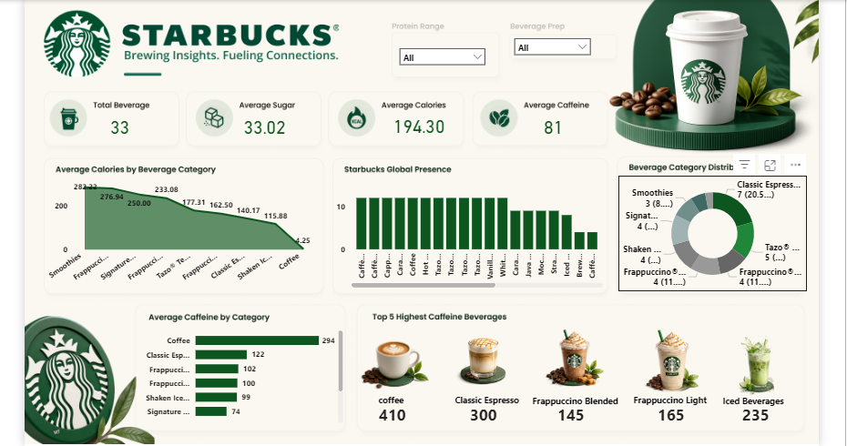

# Starbucks Nutrition Analytics Dashboard

## 📌 Project Overview

This Power BI dashboard provides an interactive analysis of Starbucks beverage nutrition data.

## 🎯 Objectives

- Analyze nutritional information of Starbucks beverages.
- Identify beverages with the highest caffeine content.
- Compare average calories across beverage categories.
- Understand beverage category distribution.
- Enable interactive filtering for better decision-making.

## 📊 Dashboard Features

### KPI Cards
- Total Beverages
- Average Sugar
- Average Calories
- Average Caffeine

### Interactive Filters
- Protein Range
- Beverage Preparation Type

## 📷 Dashboard Preview

## 🛠️ Tools & Technologies Used

- Microsoft Excel
- Power BI Desktop
- Power Query
- DAX
